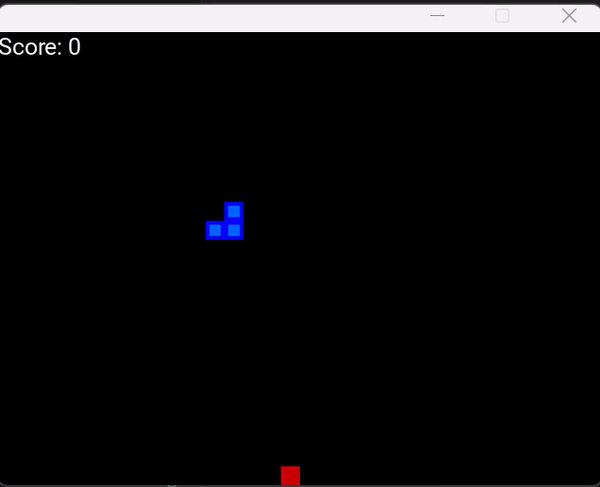
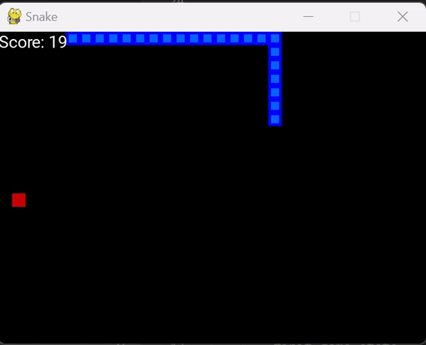
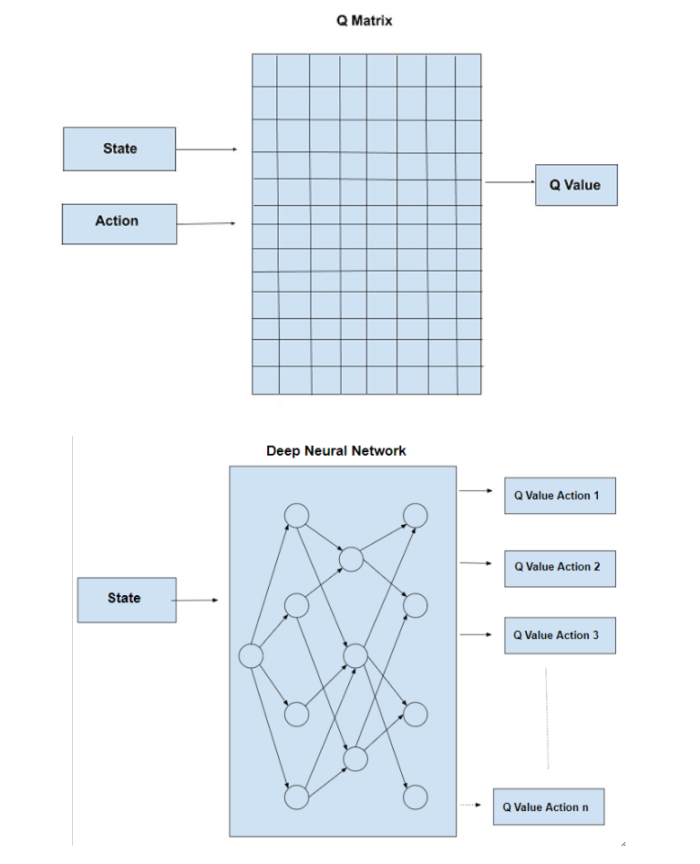
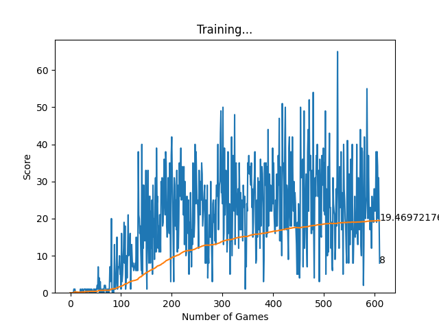

# Snake-game-deep-learning

# Snake-game-deep-learning

# How to Teach AI to Play Games: Deep Reinforcement Learning

## Introduction

Artificial Intelligence and Gaming, contrary to popular belief, do not always align perfectly. This might sound controversial, but here's why: there's a distinct difference between Artificial Intelligence and Artificial Behavior. In gaming, we don't want agents that outsmart players but rather ones that provide fun and engagement by mimicking human-like behavior. In contrast, optimizing an AI to outperform human players can be extremely valuable in other fields, as demonstrated by Google DeepMind's AlphaGo.

In this project, we will develop an AI agent capable of learning to play the classic game Snake from scratch using Deep Reinforcement Learning (DRL). We'll implement a DRL algorithm using both Keras on top of TensorFlow and PyTorch, allowing you to choose your preferred framework. The AI agent interacts with the game environment, learns from its actions, and strives to maximize its score by following a policy derived from its training experience.

## The Game

The Snake game was coded in Python using Pygame, a library for creating simple games. Initially, the AI agent has no knowledge of the game and performs random actions. However, after training, the AI learns effective strategies to play the game successfully.

### Before Training



### After Training



## How Does It Work?

### Reinforcement Learning Overview

Reinforcement Learning (RL) is a family of algorithms used for control and decision-making tasks, expressed as Markov Decision Processes (MDP). This involves defining a set of states \( S \), actions \( A \), a reward function \( R \), and a transition function \( T \). In this project, we use Deep Q-Learning, an RL algorithm that leverages a deep neural network to approximate the Q-value function.

### Deep Q-Learning Algorithm

The high-level steps of the Deep Q-Learning algorithm are as follows:
1. **Initialize** the Q-value function randomly.
2. **Observe** the current state.
3. **Choose** an action based on the current state using a policy derived from the Q-value function.
4. **Perform** the action and receive a reward from the environment.
5. **Update** the Q-value function based on the received reward and the new state.
6. **Repeat** until a termination condition is met (e.g., the game ends).

### State Representation

In our implementation, the state is represented by an array of 11 boolean variables indicating:
- Immediate danger (left, right, straight).
- Current direction (up, down, left, right).
- Food location relative to the snake's head (above, below, left, right).

### Reward Function

The reward function is defined as:
- +10 for eating food.
- -10 for hitting a wall or the snake itself.
- Optionally, a small positive reward for each step taken without dying.

### Neural Network Architecture

The neural network used in this project consists of:
- 3 hidden layers with 120 neurons each.
- An adaptive learning rate starting at 0.0005 and decreasing to 0.000005.
- The network outputs the Q-values for three possible actions: move left, move right, move straight.

## Implementation

### Training Loop

The core training loop involves the following steps:

```python
while not game.crash:
    agent.epsilon = 80 - counter_games
    state_old = agent.get_state(game, player1, food1)
    
    if randint(0, 1) < agent.epsilon:
        final_move = to_categorical(randint(0, 2), num_classes=3)
    else:
        prediction = agent.model.predict(state_old.reshape((1,11)))
        final_move = to_categorical(np.argmax(prediction[0]), num_classes=3)[0]
    
    player1.do_move(final_move, player1.x, player1.y, game, food1, agent)
    state_new = agent.get_state(game, player1, food1)
    reward = agent.set_reward(player1, game.crash)
    agent.train_short_memory(state_old, final_move, reward, state_new, game.crash)
    agent.remember(state_old, final_move, reward, state_new, game.crash)
    record = get_record(game.score, record)
```
### Final Results
After training, the AI agent averages 40 points on a 20x20 game board, with a record score of 83 points. The plot below shows the learning progress over time, with the AI initially scoring poorly but improving significantly as it learns.

**Example Training Results:**

- Game: 527 Score: 31 Record: 54
- Game: 528 Score: 65 Record: 65



### Conclusion
Training an AI to play games using Deep Reinforcement Learning is a fascinating and rewarding endeavor. By following the steps outlined in this project, you can develop an AI agent capable of learning and mastering the game of Snake. This project serves as an introduction to DRL and its applications in gaming and beyond.


### Getting Started
Prerequisites
Python 3.6 or later
Pygame
PyTorch
Matplotlib
NumPy

### Running the Game
To start training the AI to play Snake, simply run:
```python
python agent.py
```

### Repository Structure

- `agent.py`: Contains the main training loop and the Agent class.
- `helper.py`: Contains helper functions for plotting training progress.
- `model.py`: Contains the neural network model and trainer class.
- `snake_gameai.py`: Contains the Snake game logic and environment.
